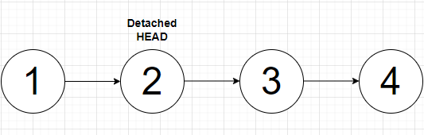
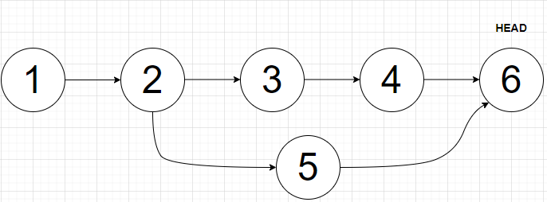

# Desafio Murano - Questão 2 - Git

Este repositório responde as questões solicitadas sobre os comandos do Git e como sincronizar uma biblioteca compartilhada utilizada por dois projetos de software distintos.

## Comandos Git

Três exemplos de comandos do Git e suas funcionalidades:

1. **Git Branch**

    Uma branch em um sistema de controle de versão é uma estrutura de desenvolvimento independente da linha de desenvolvimento principal do repositório, que possibilita o desenvolvimento/teste em paralelo de novas funcionalidades antes de integrá-las ao código principal.

    No Git, o comando `git branch` é responsável pelo gerenciamento de branches. É possível com esse comando criar, listar, renomear e deletar novas branches de um repositório. A criação de uma branch no Git não é nada mais que a criação de um ponteiro indicando de que ponto (Commit) da linha principal àquela branch surgiu, ou seja, qual era o estado do desenvolvimento no seu ínicio e, a criação de uma área própria de desenvolvimento com as mesmas estruturas da linha de desenvolvimento principal (Histórico de Commits, Área Temporária (Staging Area) e etc.). Esse comando não possibilita trocar de uma branch para outra, para desenvolver na branch é necessário o uso do comando `git checkout`.

2. **Git Clone**

   O comando `git clone` é usado para criar cópias locais de um repositório central. Em um processo de desenvolvimento colaborativo, os desenvolvedores precisam criar suas próprias cópias locais do repositório central e trabalhar nelas. Esse comando permite acessar a URL do repositório por meio de vários protocolos, como SSH, HTTP e FTP. Ao acessar uma URL válida, os arquivos da versão mais recente do repositório são baixados e armazenados junto com o histórico de versões em uma pasta local. Com o repositório local, você pode editar arquivos, fazer novos commits, acessar outras branches, etc.

3. **Git Merge**

   O comando `git merge` é usado para integrar alterações de uma branch para outra. Após concluir o desenvolvimento em uma branch, é necessário integrar a nova funcionalidade à linha principal de desenvolvimento. Esse comando compara as duas linhas de desenvolvimento e analisa o código para verificar se há alterações conflitantes. Se houver alterações conflitantes, o desenvolvedor precisa resolvê-las manualmente. Caso contrário, um novo commit é criado automaticamente, mesclando as duas linhas de desenvolvimento (branches).

   O Git oferece dois tipos de algoritmos de merge: Fast Forward Merge e 3-Way Merge. O Fast Forward Merge é possível quando não há alterações na branch principal desde a criação da nova branch. Nesse caso, o histórico da branch principal é "acelerado" (fast-forwarded) para incluir as alterações (commits) da nova branch. No caso de desenvolvimento na branch principal após a criação da nova branch, é usado o algoritmo de 3-Way Merge, que avalia três commits: os commits mais recentes de cada branch e o ponto onde as duas branches divergiram. Ele mescla os dois históricos de alteração para combinar as duas linhas de desenvolvimento.

## Sincronização de Bibliotecas

Como apresentado na resposta anterior sobre o comando `git branch`, é possível manter duas linhas de desenvolvimento independentes em um mesmo projeto, utilizando branches. No cenário descrito, basta que cada projeto crie uma branch da biblioteca e implemente modificações em sua branch própria. Os passos recomendados seriam:

1. Cada projeto cria uma nova branch da biblioteca através do comando `git branch`.
2. As modificações de cada projeto são implementadas nas branches específicas do projeto.
3. Periodicamente, as alterações feitas nas branches do projeto devem ser integradas (mescladas), através do comando `git merge`, na branch principal da biblioteca para sincronizar os projetos e evitar que as modificações se tornem incompatíveis.

## Voltar para um Commit Anterior

Para reverter para um commit anterior no Git, basta executar os comandos:

1. `git log --oneline` para verificar o hash do commit desejado.
2. `git checkout <hash_do_commit>` para retornar ao estado dos arquivos naquele commit.

## Commit em Local Indesejado

No cenário descrito, ao realizar o commit 5, ele não veria as modificações feitas nos commits 3 e 4. Para identificar a situação ele pode checar seus commits com o comando `git log --oneline` e ele só veria os commits 1, 2 e 5. Para passar suas modificações para a branch original, ele pode usar os comandos:

1. `git switch –` ou `git checkout master` para voltar ao commit 4 da branch original.
2. `git cherry-pick <hash_do_commit_5>` para realizar o merge do commit 5 com a branch principal.
3. Resolver qualquer conflito de merge.

No fim, ele terá um commit 6 com as mudanças do commit 5 na branch correta.

## Mesclando Commits de uma Branch Alternativa

Para mesclar commits de uma branch alternativa na branch principal, pode-se executar os seguintes passos:

1. Mudar para a branch alternativa onde o `HEAD` aponta para o commit 8.
2. `git rebase -i HEAD~4` para selecionar os últimos 4 commits (5, 6, 7, 8).
3. No editor de texto que será aberto, associar o commit 5 ao tipo `Pick`, pois foi o primeiro commit feito na branch com o objetivo de manter a ordem dos commits. Mescle os commits seguintes com o commit 5, associando-os ao tipo `Squash`.
4. Outro editor de texto será aberto para criar a mensagem de commit.
5. Após concluir essas etapas, o processo de mesclagem de commits é finalizado. Por fim, execute o comando `git merge master` para integrar o commit mesclado da branch alternativa na branch principal.
6. Resolver qualquer conflito de merge.

Ao fim desse processo, os commits da branch alternativa são mesclados com sucesso na branch principal.
